README

Slartboz: Fazzmagik Tales in The Sleen Groove

A sci-fi, post-apocalyptic, dystopic, dark irreverent comedy, real-time Rogue-like computer adventure game. Set in the far far (and/or very near) future. A very possible one -- however horrible, hilarious, logical or insane -- and frankly perhaps a mix of each.

For fans of Fallout & Wasteland. And the film Idiocracy, the show Stranger Things, the book "trilogy" Hitchhiker's Guide to the Galaxy, the game X-COM, and of course both NetHack *and* Dwarf Fortress. Because reasons. Oh, heck, let us toss in some Lemonade Stand, some Illuminati, a little Taipan and The Oregon Trail for good measure. Sprinkle in some of Sid Meier's Pirates. A flashback to Ultima IV: Quest of the Avatar. And a hint of Roadwar 2000? A few pretty clear homages to 1980's arcade games. And a super loving homage & act of historical fantasmagoria in the form of a Slartboz-ification of the OG 80's Cast-- NO, IT IS TOO MUCH! YES, IT IS FAR TOO MUCH, MR. KINCAID. Instead, you'll have to uncover some of these things ALL on your own. Through play, directly. There are soooo many easter eggs and unpromoted mini-games. (In our design anyway. Like, on paper. Stored in a vault somewhere. *cough*.) Therefore the old words of advice still apply. To wit... Keep your towel handy. Lasers are your fren. "And my proton axe!" Give in to your senses, Luke. TRUST NOONE. Let alone The Computer. Arky. Especially not him.

Slartboz is also, by intent and design, a return to the kinds of 70s/80s-style computer games when their audio-visual form and UX features were considered the best of their own time. Except... now recreated and reimagined using the kinds of modern technology and tools at a programmer's fingertips in 2023. (Er, except Unity. Anything but that. *cough*.) Sooooo much memory and disk available, for example. Sooooo many otherwise idle/wasted CPU cycles! Well, we'll take care of THAT awkward little problem, folks. "Now, get off my lawn!"

A long time ago (around 2008) I made my first commerical Rogue-like, Dead By Zombie. This is my return to that medium and art form. With a massively upgraded engine (and still 100% homegrown), rewritten from scratch to enable me to deliver the feature points and technical qualities I envision for Slartboz. In other words, Slartboz is the de facto spiritual successor to Dead By Zombie. With a very different setting and premise. And a very different engine.

Dead By Zombie was strictly turn-based: you-go, they-go, you-go. Slartboz uses a "real time" engine. Time is always flowing and the world is always advancing. Though you can pause it when you need to catch your breath or do planning. Or take breaks. Breaks? Slacker!

This repo is meant only for public-facing content, like promotional material, design note samples or screenshots.

No source code.

However, once downloadable executables are avail we MIGHT make them available from here, too.

. . . . . . . . . .

GAME INTRODUCTION & OVERVIEW

The year is 2100 CE.

After a period of climate chaos, massive famine and bloody resource wars,
daily life for the vast majority of the human race who have survived
is an apocalyptic nightmare.

You are Abro. A teen male growing up in Normerika, a dangerous wasteland filled mostly with ruins and barbarians if not the utterly insane, and the sad reminders of a once great nation: the mighty United States. American democracy had been attacked relentlessly, both from within and from without, and eventually collapsed.

All you and your generation have left about it are stories.

You're in The Lazer Lizards. Its mostly just you and a group of frens.
There was a Vote and it was decided the group would go on an expedition.
Goal being to find & bring back a big cybernetic battle tank,
believed lost in The Wars.

Do you agree to embark on the Tank Search Expedition?

. . . . . . . . . .

CHARACTERS

**Abro**

You are Abro. A teen guy living in Normerika. Normerika is the year 2100's future successor to what folks back in the "real" 2020s called the USA. (notice the scare quotes around real?)

Abro wants to have Fun. And he wants to Solve Problems. Wants to be a Hero. Wants a really Nice Ride.

Abro hates jerbs and chores, however. And gunk. And bad smells (well, his best fren Bonk -- he can put up with his.) And JINTs. He despises JINTs and tries to avoid them. However, there are millions of JINTs overflowing the world, still, even after The Global Grand Shitshow played out -- just as so many of the Hyper-Geeky Oldsters (ie. scientists) had warned them about, clearly and loudly, and so well in advance.

Abro has, in his possession and under his own general control, a few assets -- however modest. He has, for example, a Lazer Pistol! An actual frickin Lazer Pistol! (Broken, admittedly.) Thus the name of his fren's club. Abro also has Fern's Wuv Pin -- a small piece of jewelry not to be dismissed or ever overlooked under penalty of gravest consequences. And he has a VERY cool-looking, old high-tech gadget called The CommCube -- also broken, of course. But with all things broken there's a chance of repairing them, even if a lover's heart is harder to mend, if not utterly impossible -- especially for the purest of romantic souls? Well, or so he's heard! He's read stories. Oh, the stories he has read! Abro likes reading almost as much as shootin lazers. And Fern. ... er, uh... NOT shooting Fern! Let me make that clear. He *likes* Fern. Really likes her. But he likes shootin lazers ALMOST as much as he likes Fern. Some days/nights he suspects he might also Wu-- NO, is too much. He will play it safe and err on the side of Lazers and Shootin and Solvin Big Interestin Probs. Safer. Soooo much safer. And his best fren Bonk would never let him live it down. The two of them have so much more projectile vomitting to do together and he intends to cherish it. "Youth wasted on the young? Heck, not on Bonk and Abro!"

Abro wants a tank. A really big tank. Like a huge 4WD off-road vehicle, but with tons of armor and Big Ass Guns as a bonus. Its a no-brainer, really. Especialy if you are 15 like Abro. And no, he does NOT even have a driver's license yet. Why? Because there IS NO driver's licensing authority. Not anymore. There is very little authority left, period, anywhere. Because government itself has collapsed, mostly. ("Mostly," re-emphasizes Newt, the ever-helpful, even while blatantly crossing multiple dimensions of fictional reality like this.) And therefore folks are generally just trying to.. well, to Survive. Each new hellish day, Livin La Vida Loca in the Normerikan wastelands of 2100 CE.

**Fern**

Fern is "In Wuv" with Abro. Nobody is quite sure, why -- neither the poor hapless boy, or, herself.

Fern loves shoes. She also has powerful mutant powers she tries to hide. But she would do almost *anything* to get a hot new pair of shoes. She has been tempted to use Her Terrible Powers in order to help her get them. But that would be Wrong (TM), right? Or would it be soooo wrong it was Totally Right (TM)? Honestly, at times, the line blurs.

**Bonk**

Best fren to Abro. Ignored/tolerated by Fern.  One of the Lazer Lizards.

**Arky**

An AI mind, a powerful genius and yet also, clearly, crazy. A remote "fren" of Abro who seems to (try to) help out, here and there.

**Tank**

A Grussian 'Goliath Mark VI'. A gigantic cybernetic main battle tank, or land destroyer, the ultimate fantasy in armored warfare, and an utter nightmare to its enemies.

. . . . . . . . . .

PLOTS, QUESTS, CHALLENGES

* **Find The Tank** -- The LL's have learned of the possibility of the survival of a rare but powerful artifact from The Bad Times, an infamous (and gigantic) Grussian Goliath Mark VI Cybernetic Main Battle Tank. If they can confirm it exists -- that its not a myth -- and locate it, and get it into working order, it could be a powerful asset in helping them survive, indeed all of Pell. Plus it would be one hell of a sweet ride!
* **A Gorm Gone By** -- The former leader of the Lazer Lizards, Gorm Radley -- who is also the new LL leader Riv's older brother -- has gone missing. The frens want to find him, obviously.
* **What's Eating Pell?** -- Someone (or something) is murdering the residents of their village, Pell. There is never a witness. One by one people just seem to... disappear. Sometimes blood is the only thing left behid. Sometimes... worse things.
* **The Hottest Shoes** -- about Fern's quest to acquire the hottest shoes imaginable, and all the shenanigans that unfold *during* that, if not completely *due* to that
* **Slurm Plant Ouroboros & Operations, Inc.**
* **Glerms Are Made Of What?!**
* **The Madness of Crowds** -- Involving the phenomenon of beliefs, propaganda, politics, lying populists, dangerous adversaries, and the general societal *signal-to-noise* ratio of life in Normerika in the year 2100.
* **The Gurls From Brazil**
* **The Candy Man Dan** -- Yes, it involves candy. And rhyming. And alliteration. And other fun language games and word-sound patterns. Also, candy. Sooooooooooo much candy. *Bonk, keep your hands out of the bowl, what have we told you?*
* **Dork Fortress** -- As is the nature of all Normerikan youth The Lazer Lizards will, in all likelihood, eventually outgrow their little clubhouse shack and want something... bigger. Much bigger. And something with much better features. Something... *far* more impressive. And customized totally to their tastes. To their very specific tastes. Even to Bonk's very specific and ultra-geeky tastes -- that sick bastard.
* **The OOBMSDP** -- Involving what might be the most bureaucratic, inane, pinheads-and=paperwork-driven large bizcorp/gubmint that has ever existed. It is up to Abro single-handedly to stop them. Er, I mean, to avoid them. Evade them? Make fun? Perhaps a wee bit of sabotage along with close frens?
* **The Manchurian Lazer Lizard Candidate** -- One among the LL's is not exactly who he seems. Rather, an Enemy within, a wolf in sheep's clothing. No, he is *not* a furry and this does not involve cosplay.
* **The Pit of Despair**
* **The Strangest Things** -- Some young ladies have certain Powers, ones both Great and Terrible.
* **All Hail The De-Ity** -- The LL's investigate an awful, but seemingly all-powerful, cult
* **Last Ditch Defense / The Battle of West Pell** -- A massive herd of zombies approaches the hometown of Abro and his frens. Guess upon whose shoulders it falls to try saving Pell from what would surely otherwise lead to an unstoppable stampede overrun and slaughter of the innocent?
* **X: The Planet Formerly Known As Mars** -- A plot which may or may not involve the mythical mega-preneur Elong Mux. Let's just say there's lots of innovation and shitposting, and in about equal parts.
* **The Machine Mechanization Matrix** -- A race of self-directing, self-replicating machines hate humanity and wishes to enslave it, if not destroy it and drive it to extinction entirely. In a distracted and divided world it might just be up to The Lazer Lizards, alone, and at the height of their amassed power, to stop them.
* **The Abominable Dr. Hexenhammer** -- "Rise, my dear Melody, rise! Rise my dear new wife, born of The Blood, reborn of The Word. No, my young frens who I know are listening, NOT the one from Grease." *(mad cackling!) (lighting strikes!) (more cackling!) (ominous thunder!!) (yet more lightning!!!) (then cackling again, obvs)*
* **The Root of Happiness**
* **Once And Future King, Again**

. . . . . . . . . . . . . . . . . . . . . . . . . . . . .

GAME ENGINE FEATURES & PLAY MECHANICS

* like **NetHack**... but with a **real-time engine**. and with **sounds** and **music**

* like **Dwarf Fortress**... but with a **future**, sci-fi, **post-apoc** setting

* an **adventure** game with **RPG** aspects... but also **military-style** squad-level **combat** and operations-scale **battles**

* has dramatic **plots** and **stories** galore... but also provides an **open sandbox** for free-form play. One filled with, in essence, a wide assortment of **toy soldiers** and **action figures** and all the cool **bases** and **vehicles** and **weapons** and high-tech, whizbang **gadgets** any kid would want. (Indeed, one of the designer's frequent self-questions he asks, while working on it, is, "What would 10-year old me want to do here? What would he want to be able to do with it? What would he *wish* that he could *make happen* in this game? What would *amuse* him? Oh, and for now just forget about the morally Right or Wrong, the sane or insane, the appropriate or immature, or whether practical or not -- what would be *frickin FUN?!*" and then I (try to) go make that happen. In the Slartboz code, bringing it to life.)

* a **game**, so meant to be **Fun**. but also has a series of **Lessons** on serious **Educational** topics. about **climate** and **democracy**. about **dangers** to both, and opportunities to do mitigations (big, bold and/or urgent ones), or to innovate or make "upgrades" to our society and laws related to them. (eg. like closing loopholes exploited by foreign (or domestic) enemies, or traitors. Can anyone think of any real-world examples where that might have happened in US history to date? Hmmmm...)

* though the game's world is set in a terrible (and stupid, and unnecessary) **Dystopia** the design goal of the player's experience is to help encourage a path leading us closer towards an ideal, long-term and (much more) sustainable **Utopia**

. . . . . . . . . . . . . . . . . . . . . . . . . . . . .

GAME & TOY INSPIRATIONS, INFLUENCES AND/OR MOST SIMILAR

These are listed in no particular, meaningful, order:

(TODO add links for each?)

* NetHack
* Dwarf Fortress
* Minecraft
* X-COM
* Taipan
* Ultima 1-4
* SimCity
* The Sims
* Little Computer People (from 80s)
* Sid Meier's Pirates
* Seven Cities of Gold (by Bunten for EA)
* Castle Wolfenstein (the 80s 8-bit era OG, by Silas Warner for Muse Software)
* Lemonade Stand
* The Oregon Trail
* Roadwar 2000
* Autoduel
* Rocky's Boots, and (its de facto sequel) A Robot Odyssey
* Paranoia (80's TTRPG by Costikyan and WEG)
* Call of Cthulhu (80's TTRPG by Chaosium)
* LEGO
* G.I. Joe: 80s Hasbro action figure toys and comic book series
* Advanced Squad Leader, table-top wargame by Avalon Hill then MMP
* my own old "Dead By Zombie" game from the year 2008

. . . . . . . . . .

SCREENSHOTS

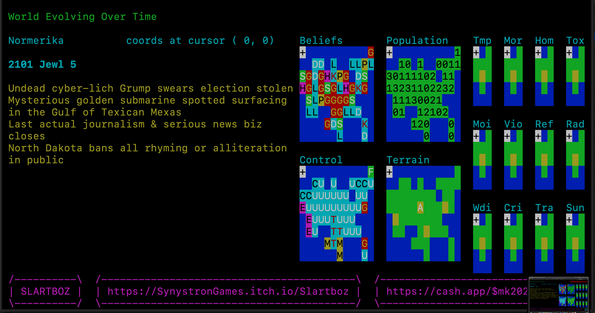

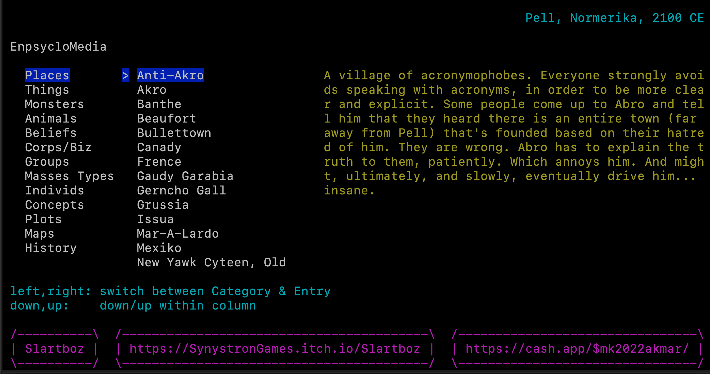

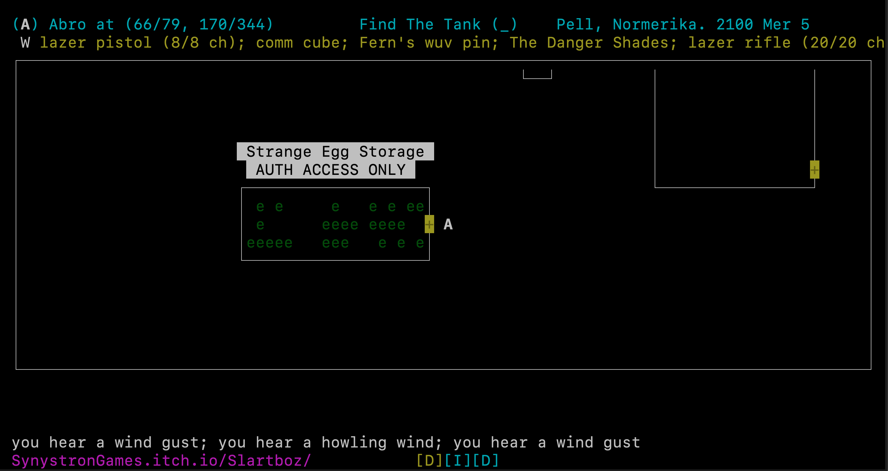

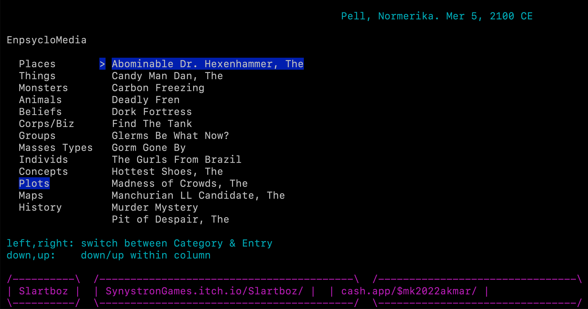

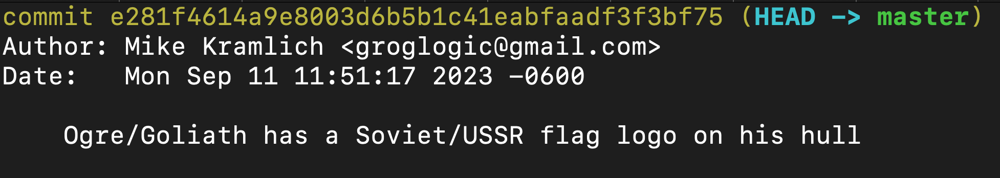

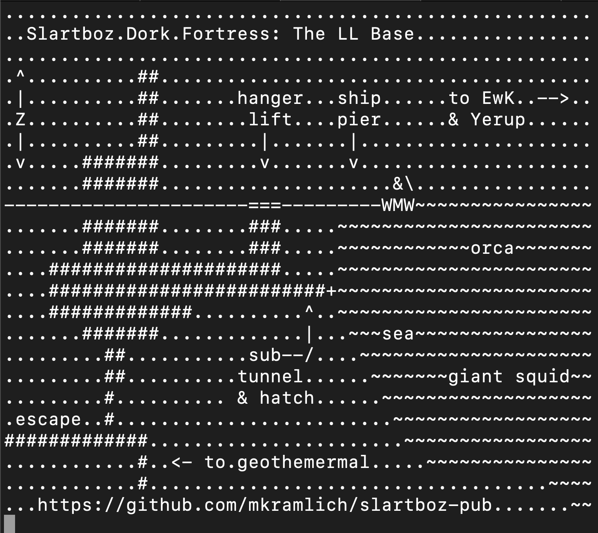
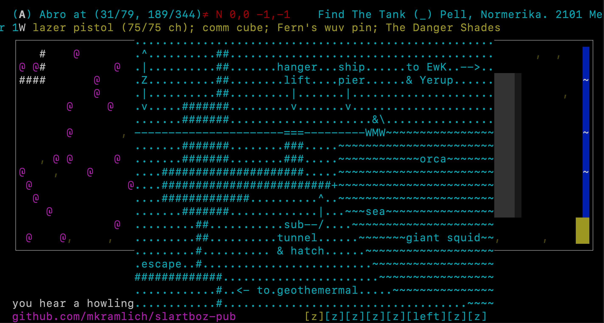
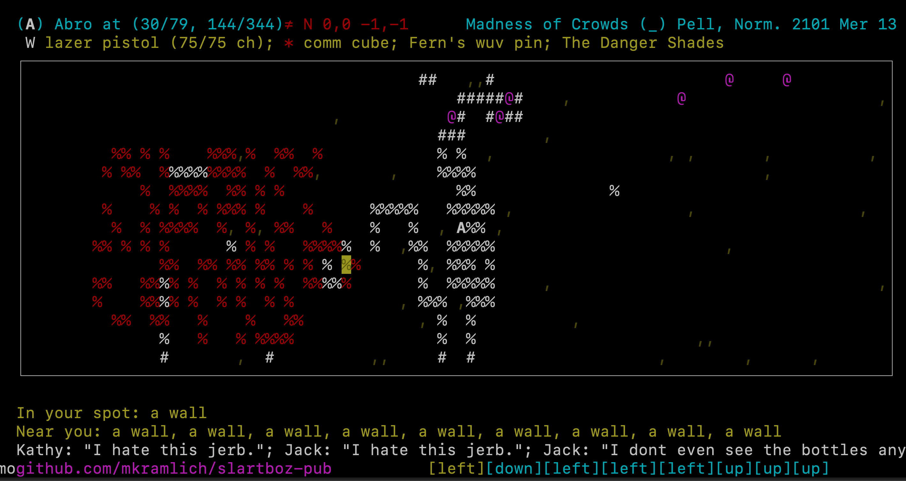
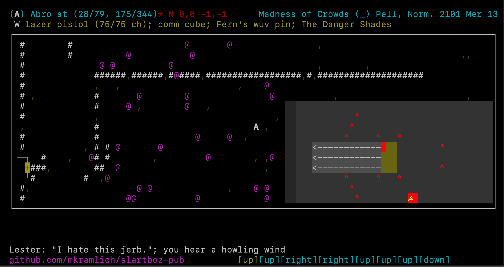
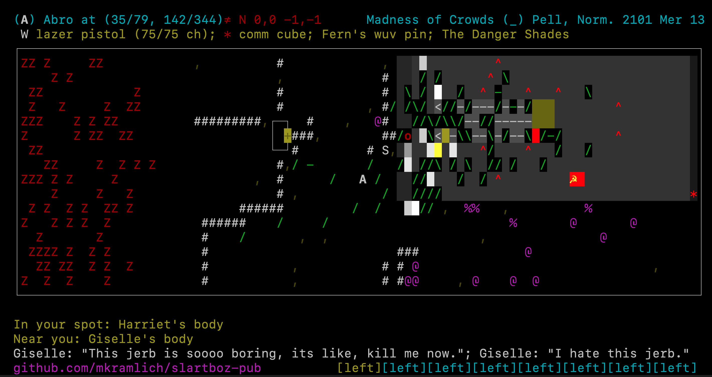
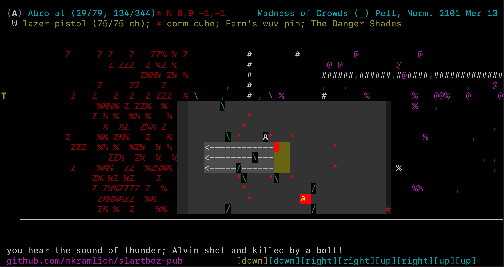
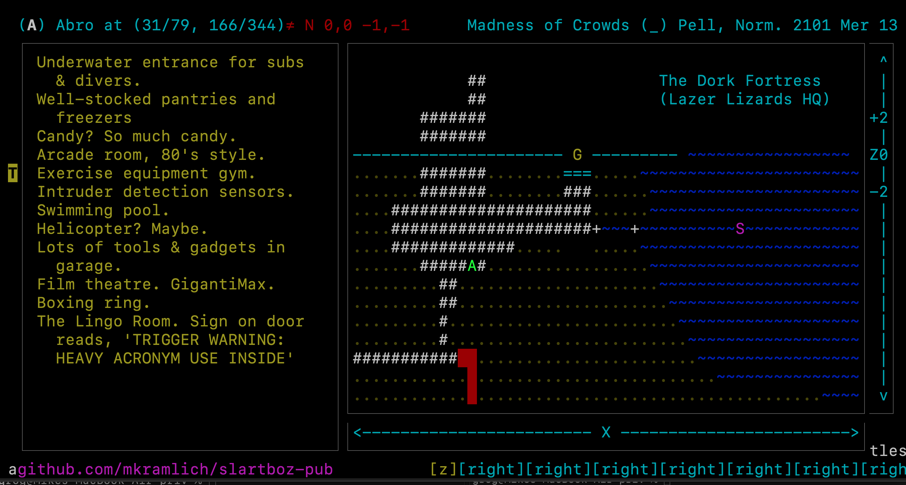
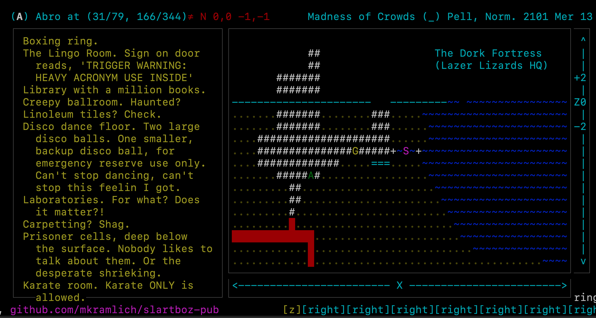

. . . . . . . . . .

VIDEOS

Lazers, Monsters, The Oddly Obedient, Power Drunk, Subtle Error, Death Oops & A Few Smol
    https://youtu.be/ZqmDL_y15bc

The World Evolving Over Time
    featuring "Arky the Mad AI Mind"
    and the comedy & tragedy of the relentless momentum of time
    https://youtu.be/BADPcTEx_v0

A Slideshow of Screenshots
    https://youtu.be/20G-rZzPjeU

The Pell Community Swimming Pool
    https://youtu.be/K1Z7lWZLBXI

Tanks Shooting on The Proving Grounds
    https://youtu.be/M2WUu9CYco0

A Boy and his Gigantic Grussian Goliath Mark VI Cybernetic Main Battle Tank: A Zombie Herd Slaughter in The Ruins West of Pell, Normerika, 2101 CE
    https://youtu.be/MUpTkKiOMic

Dork Fortress early prototyping. Z-level cutaway. base's feature list. Arky the Mad AI narrates
    https://youtu.be/hbhsJOYYZJ4

Project Intro, UI Guide, The Gigantic Grussian Goliath Mark VI Cybernetic Main Battle Tank (Think: Friendly Kaiju) vs A Massive Zombie Herd, and The Dork Fortress, and... Arky the Mad AI (Quite Mad, Really)

part 1 of 2: https://youtu.be/mDokKbHyOno
part 2 of 2: https://youtu.be/KPVIq39HoUM

. . . . . . . . . .

Open Source Sharing

[latlearn](https://github.com/mkramlich/latlearn): latency instrum & reporting lib, in Golang

. . . . . . . . . .

RELEASE PLAN

* **September 2023:** 1st playable exe to invite-only playtesters. Mac builds only (at first)
* **October:** Windows version also avail for playtesters
* **November:** 1st version of playable exe for the general public. will be **FREE**. tho a subset of full game's features and content. Mac only (at first)
* **December:** Windows version of above ALSO becomes avail
* **January:** for-sale only version ALSO made avail to public. full/deluxe game features & content. Mac & Win  

This plan may be revised as we go.

. . . . . . . . . .

Project Links

This game project's presences online:

* [GitHub (this repo)](https://github.com/mkramlich/slartboz-pub/)

* [Mastodon](https://toot.io/@synlogic/)

* [YouTube](https://www.youtube.com/@Groglogic/)

* [Reddit](https://www.reddit.com/user/Slartboz/)

* [Itch.io](https://SynystronGames.itch.io/Slartboz/)

* [Tips & Donations (via CashApp)](https://cash.app/$mk2022akmar/)

* [Support Memberships ($1/mo)](https://patreon.com/SynystronGames/)

* [email](mailto:groglogic+slartboz@gmail.com)

This document's last update: 2023 Sep 27

